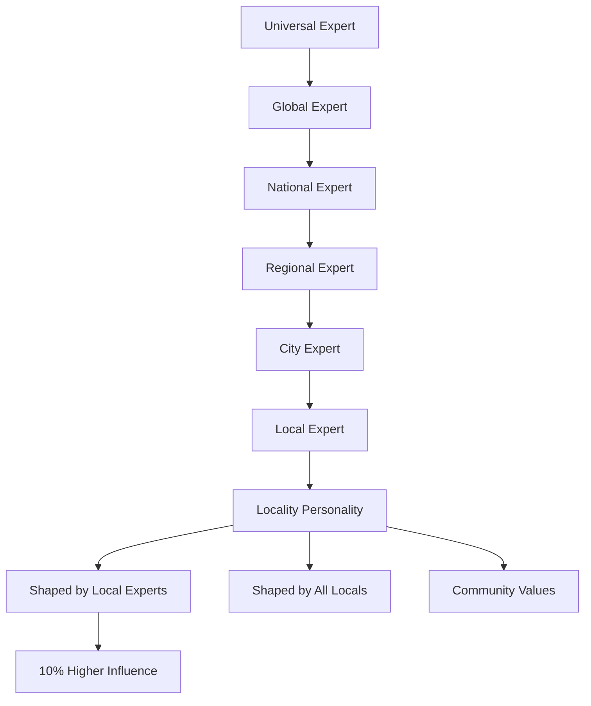

# Expertise Network Layers Diagram

**Created:** December 8, 2025, 5:32 PM CST  
**Purpose:** Visual diagram of expertise network layers

---

## 📊 **ASCII Diagram**

```
┌─────────────────────────────────────────────────────────────┐
│                  EXPERTISE NETWORK LAYERS                    │
└─────────────────────────────────────────────────────────────┘

Universal Expert
  └─ Global network access
      │
      ▼
Global Expert
  └─ International network access
      │
      ▼
National Expert
  └─ National network access
      │
      ▼
Regional Expert
  └─ Regional network access
      │
      ▼
City Expert
  └─ City-wide network access
      │
      ▼
Local Expert
  └─ Locality-specific network access
      │
      ▼
┌─────────────────────────────────────────────────────────────┐
│                    Locality Personality                      │
│                                                               │
│  Shaped by:                                                   │
│  - Local expert behavior (10% higher influence)            │
│  - All local user behavior                                   │
│  - Community values and preferences                          │
└─────────────────────────────────────────────────────────────┘
```

---

## 🔄 **Mermaid Diagram**



---

## 📋 **Expertise Levels**

1. **Universal Expert** - Global network access
2. **Global Expert** - International network access
3. **National Expert** - National network access
4. **Regional Expert** - Regional network access
5. **City Expert** - City-wide network access
6. **Local Expert** - Locality-specific network access

---

## 🔗 **Related Documentation**

- **Expertise Network Layers:** [`../EXPERTISE_NETWORK_LAYERS.md`](../EXPERTISE_NETWORK_LAYERS.md)
- **Architecture Layers:** [`../ARCHITECTURE_LAYERS.md`](../ARCHITECTURE_LAYERS.md)

---

**Last Updated:** December 8, 2025, 5:32 PM CST

