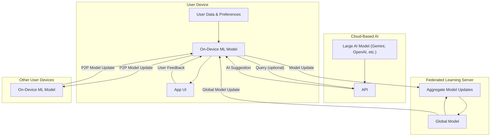

# SPOTS AI/ML, Federated Learning, and ai2ai Architecture

This architecture must be followed for all future AI/ML and federated features.

## System Diagram

## Explanation
- On-device ML learns from user data and feedback, and can make recommendations offline.
- Cloud-based AI can be queried for advanced suggestions, and its outputs can be used to improve the local model.
- Federated learning aggregates model updates from many devices to improve a global model, which is then sent back to all devices.
- P2P model updates allow devices to share intelligence directly, even without a central server.

## ai2ai Networking Options
- ai2ai model updates are exchanged through monitored ai2ai services that mediate device interactions, avoiding direct device-to-device connections and preserving privacy and oversight.
  - **Bluetooth** and **WiFi Direct** may be used as transports, but all flows are mediated through ai2ai protocols.
  - **Local WiFi/LAN** and **Cloud relay** are supported via ai2ai channels.
  - **Cellular data** is a fallback when appropriate.
  - The system prefers private, local, and bandwidth-efficient methods, while ensuring all interactions pass through the personality learning AI to form a monitored ai2ai network.

## Core Data Model Principles
- Lists are independent nodes, not just user-tied
- Curator/collaborator/follower roles (collaborators can add/remove spots, curators can delete the list)
- Silent role management (roles are not shown in UI, only used for permissions)
- Age-restricted lists (curator can require age verification for 18+ content)
- Reporting system for lists (users can report lists, not users; 5+ lists reported by 3+ users in <3 weeks = 1 week suspension)
- Tiered system for public promotional lists (pinned for future)

## AI/ML & Data Collection Principles
- Detailed location tracking and real-life interaction detection as core features
- AI/ML training on all available data (location, time, feedback, list interactions, etc.)
- Organic/algorithmic balance: user behavior is always organic, app is always algorithmic, recommendations are a blend 