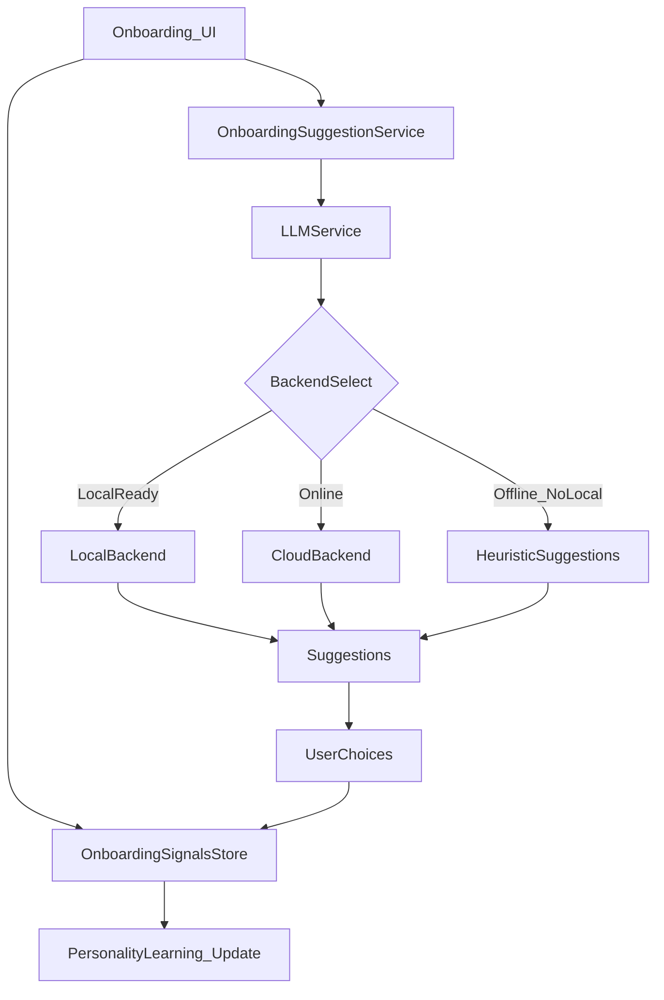
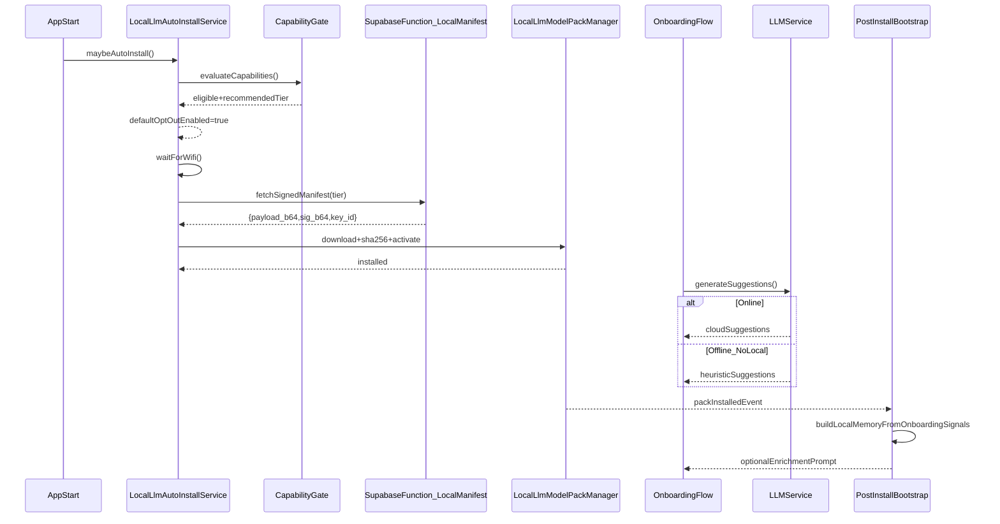

# Onboarding ↔ LLM Suggestions ↔ Model-Pack Download (Opt-Out) ↔ Bootstrap

**Date:** January 1, 2026  
**Status:** Active – Source of truth for onboarding + LLM provisioning  
**Scope:** Phase 8 onboarding pipeline + local model-pack lifecycle (Option B runtime)  

---

## Why this document exists

Onboarding uses LLM-powered suggestions (lists, places, tone, prompts) to elicit user reactions that sharpen the personality profile.

Local inference (Android GGUF, iOS CoreML) **may not be ready at onboarding time** because the model pack is downloaded after app install (large artifacts, Wi‑Fi-first).

This document defines how we keep onboarding quality high **even when the local pack arrives later**, without breaking privacy and without duplicating logic across UI pages.

---

## Core principles (non-negotiable)

- **Onboarding writes structured signals.** LLM output is an “elicitation tool”, not the truth.  
  What matters most: what the user *picked, rejected, edited, and revisited*.
- **LLM backend is pluggable.** During onboarding we can use:\n  - **Cloud LLM** when online (best immediate quality + centralized abuse controls)\n  - **Heuristic/curated suggestions** when offline (still collects strong signals)\n  - **Local LLM** once the pack is installed and active
- **Local pack provisioning is opt-out, Wi‑Fi-first.** Eligible devices default to offline enabled.  
  The multi‑GB download is queued until Wi‑Fi (and may also wait for charging + idle window).
- **Post-install bootstrap exists.** When local becomes available, we convert onboarding signals into a stable local memory/system prompt and optionally ask 1–3 “refinement” picks.

---

## High-level data flow

---

## Lifecycle sequence (install → onboarding → local-ready bootstrap)

---

## Contracts

### 1) Onboarding suggestion provenance (required)

Every suggestion shown during onboarding MUST be recorded with provenance so we can:
- measure quality,
- adjust confidence weighting,
- run post-install enrichment when offline fallback was used.

**Minimum fields:**
- `surface`: where the suggestion appeared (baseline lists, places, follow-up prompts)
- `provenance`: `cloud` | `local` | `heuristic`
- `prompt_category`: e.g. `coffee`, `museums`, `trivia_night`, `quiet_third_place`
- `suggestions`: the list shown (IDs + display text)
- `user_action`: accept/reject/edit/skip + timestamps

### 2) Local pack provisioning state (required)

Onboarding UI must be able to render:
- `not_installed` → queued for Wi‑Fi
- `downloading` (optional progress)
- `installed_not_bootstrapped`
- `ready`
- `error` (with retry semantics)

### 3) Post-install bootstrap output (required)

Bootstrap produces a stable local “profile memory” consumed by the local LLM backend:
- `system_prompt` (or system-style guidance)
- `style_guide` (tone adaptation)
- optional: embeddings/index for onboarding transcript (if available)

---

## How this protects onboarding quality

### Online onboarding
- Use cloud suggestions immediately.\n  Result: high-quality suggestions; strong personalization signals from user reactions.\n  Local pack later is a runtime switch, not a logic change.

### Offline onboarding
- Use heuristics/curated suggestions.\n  Result: suggestions are “less clever” but signals remain strong.\n  Once local is installed, run enrichment:\n  - generate improved suggestions using stored onboarding answers\n  - ask 1–3 quick refinement picks\n  - update confidence scores (do not rewrite history)

---

## Related code touchpoints (current)

- Startup auto-install: `LocalLlmAutoInstallService.maybeAutoInstall()`
- Provisioning state + progress: `lib/core/services/local_llm/local_llm_provisioning_state_service.dart`
- Pack manager (download/verify/activate): `lib/core/services/local_llm/model_pack_manager.dart`
- Signed manifest verification: `lib/core/services/local_llm/signed_manifest_verifier.dart`
- Manifest provider: `supabase/functions/local-llm-manifest/index.ts`
- LLM backend selection + prompt injection: `lib/core/services/llm_service.dart`
- Post-install bootstrap service: `lib/core/services/local_llm/local_llm_post_install_bootstrap_service.dart`
- Settings UI (install + refine): `lib/presentation/pages/settings/on_device_ai_settings_page.dart`
- Onboarding UI status/progress: `lib/presentation/pages/onboarding/onboarding_page.dart`
- Suggestion provenance logging:
  - `lib/presentation/pages/onboarding/baseline_lists_page.dart`
  - `lib/presentation/pages/onboarding/favorite_places_page.dart`
  - `lib/presentation/pages/onboarding/ai_loading_page.dart`
- Onboarding pipeline plan: `docs/plans/onboarding/ONBOARDING_PROCESS_PLAN.md` (Phase 8)
---

## Implementation status (current)

As of **January 2, 2026**, the following is implemented in code:
- **Provisioning state surfaced in onboarding UI**, including **progress percent + bar** during download.
- **Auto-install gating**: Wi‑Fi + charging/full + idle window, with queued phases exposed (`queuedWifi`, `queuedCharging`, `queuedIdle`).
- **Post-install bootstrap** persists:
  - a rendered `systemPrompt`
  - a structured `LocalLlmMemoryProfile` for deterministic re-rendering
  - refinement selections and pending refinement prompts
- **Refinement picks UI** is available in Settings and persists choices.
- **Expanded onboarding suggestion provenance logging** beyond baseline lists.

## Non-goals
- This document does not define the full CoreML runner on iOS.
- This document does not define LoRA training implementation.
- This document does not define the entire onboarding UX; it defines the LLM/suggestion/download integration points.

